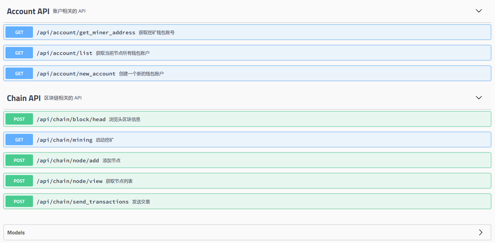

# blockchain-java

> 区块链钱包 Java 的简易实现版，自学了一段时间的区块链理论知识，自己尝试着写一个具有钱包雏形的区块链项目，开源出来，
供像我一样想开发区块链又不知从何下手初学者参考。目前大部分区块链从业者都是从事 DApp 开发，做底层链开发的还是比较少，目前也没有很大必要，
不过尝试写链可以更好的理解区块链底层的运行逻辑。本人在开发的过程中最大的体会是，在理论学习的时候觉得区块链知识并不复杂，
理论自己都懂了，但是真要自己实现了就会发现有各种坑，最后才发现自己对某些细节理解还是一知半解。
希望这个项目能对初学区块链者有所帮助，大家一起学习，一起成长。

### Version 1.3
1. 移除账号同步广播功能，各个节点根据交易记录生成本地账号
2. 加入 swagger 依赖，生成 API 文档
3. 调整 API 结构， 更新 README 文档
4. 修复一些已知的bug
5. 加入共识和自动挖矿


### Version 1.1
1. 将项目名称修改为 ppblock
2. 重构钱包生成算法，修改了签名算法，新增通过助记词创建钱包, 新增生成 keystore file 钱包文件功能
3. 支持通过私钥字符串， 助记词，助记词+密码，keystore + 密码等多种方式恢复钱包(此处可以点赞)
4. 修改了交易(Transaction) 和账户（Account)实体的数据结构, 职责更加明确，Account 不在存储公钥等数据，只存储地址和余额。
5. 鉴于网上很多同学都吐槽说项目启动的时候一直不断的抛出异常，其实这是系统启动之后自动同步其他节点的最新区块数据导致的,因为 tio 
配置的初始同步节点都没有启动，所以一直抛出连接超时的异常，其实这并不影响系统运行，但是为了方便那些有强迫症的同学（本人也是强迫症患者）, 增加了　node-discover 配置，可以手动关闭　p2p　网络同步，作为单节点测试运行。
6. 添加发送交易后自动挖矿功能，可配置成手动挖矿，默认是自动挖矿，如果初学者建议配置手动挖矿，这样你能更清楚的了解整个区块链交易工作的流程
7. 修复了一些已知的　Bug...

### Version 1.0
1. 初步了完成的区块链的各个模块，包括账户，区块链，网络等模块实现
2. 实现了账户创建，发送交易和挖矿功能
3. 实现了网络功能，包括发送广播账户，广播区块，广播交易以及自动同步区块功能。

## 单节点部署
__这个很简单, 直接像运行普通的 SpringBoot 项目一样运行就好了，单节点默认使用的 node1 节点的配置__

## 多节点部署
项目默认部署3个节点，创建了3个配置文件 application-{env}.yml， 
如果想要部署更多的节点，再创建更多的配置文件就 OK 了。

使用 idea 部署测试非常简单，按照下面的方法添加多个 springBoot 启动配置。


然后分别启动 3 个节点就好了。启动之后节点之间自动连接成 P2P 网络，随后你就可以使用 postman 工具进行测试了，如果没有安装 postman 的话请自行安装，或者和我一样使用 chrome 浏览器的 postman 扩展。

## Web 测试 API

API名称 | 请求方式 | URL 
--------|---------|------
生成钱包 | POST | /api/account/new_account
查看钱包列表 | GET | /api/account/list
获取挖矿账号 | GET | /api/account/get_miner_address
启动挖矿 | GET | /api/chain/mining
发送交易 | POST | /api/chain/send_transactions
查看最后一个区块 | GET | /api/chain/block/head
添加节点 | POST | /api/chain/node/add
查看节点 | GET | /api/chain/node/view

> 注意：凡是 POST 请求都是使用 RequestBody 的方式传参的， 不是用表单的 form-data 形式， 比如发送交易的参数形式如下：

```
{
    "name" : "value",
    "name2" : "value2"
}
```
## 简单测试
首先依次启动 node1 - node3 3个节点，由于在启动的时候会自动链接初始化的节点，各自连接成为一个 P2P 的网络，所以被链接的节点没有启动的时候会抛出网络异常，不用管它，等其他节点启动好了之后又会自动连接上的。

你可以使用 PostMan 工具对上面的 RESTFUL api 进行一一测试。不过从 v1.2 之后我在项目中集成了 swagger2，所以现在更好的测试是直接使用 swagger 
的 api ui 页面进行测试： http://localhost:8081/swagger-ui.html

 
 
 直接点击相应的 api 进行测试就 OK 了。

# 关于技术讨论群

**由于本人时间分配问题，目前没有时间维护技术讨论群，有问题请提交 issue，如有不便，请多多包涵。**
